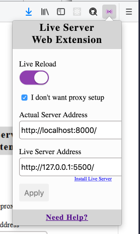

# [PHP Fundamentals]

## Instructor: [Ahmed Abdulrahman][instructor url]

Now we are ready to dig into building your own dynamic websites? We will see how PHP works from scratch then learn OOP and Design Patterns.

## Description

This repository contains code and related materials for [PHP Fundamental][video list] playlist.

[instructor url]: https://github.com/AhmedAbdulrahman
[video list]: https://www.youtube.com/playlist?list=PLOC-w_ANZDJV1E_OqZckyonhQhp1R7Xb5

## Download and Setup PHP

1.  Step 1: download the files 
   تنزيل ملفات اللغة

    * For Mac and Linux users you can ownload PHP from official website http://php.net/downloads.php.
    لمستخدمي انظمة الماك واللنكس يمكنكم تحميل ملف اللغة من الموقع الرسمي اعلاه

    * For windows users you can donwload PHP from here https://windows.php.net/download , don't forget to choose either 64Bit or 32Bit (82) based on your OS.
    لمستخدمي نظام الوندوز يمكنكم تحميل ملفات اللغة من الموقع اعلاه ولكن قبل التحميل تاكد من اختيار المسار الصحيح للنظام هل هو 64 
    بت ام 32 بت
   **** ملاحضة تذكر ان عملية تنزيل الملفات تكون على صيغة ملفات مضغوطة
   
2.  Step 2: extract the files
   **بعد اكتمال عملية التنزيل ناتي الى عملية فك الضغط

    * After you download PHP as a zip file, then you need to extract PHP files and copy it where you OS is located Like **C:\php**.
      ** بعد قيامك بعمليه فك الضغط قم بنسخ ملفات اللغة بشكل كامل وضعها في مجلد حرف سي
3.  Step 4: add **C:php** to the path environment variable

    * **First way using Control Panel:** To ensure Windows can find PHP, you need to change the path environment variable. From the Control Panel, choose System, select the **“Advanced”** tab, and click the **“Environment Variables”** button. Scroll down the System variables list and click on **“Path”** followed by the “Edit” button. Enter “;C:\php” to the end of the Variable value line (remember the semi-colon). When you finish, you might need to reboot at this stage.

    

    * **Second way using Command Line:** If you have PHP folder inside **C:\php** and want to add to the path variable, we can run the below command.
      `setx path "%path%;c:\php"`
      
         ** عملية اضافة الباث الخاص بلغة بي اج بي الى الباثات الخاصة بنظام التشغيل فائدة هذه العملية لكي تعمل اللغة دون الحاجة لتنصيب سيرفر تشغيل خاص بها    
         ابحث في الكوكل حول كيفية اضافة باث الى النظام واتبع الخطوات

## Enable Live Reload with VSCode Live Server Extention

1.  Install VS Code from Microsoft. (code editor)
2.  Install VS Code Live Server. (extension to code editor)
3.  Install the browser add-on;
    1.  [Chrome](https://chrome.google.com/webstore/detail/live-server-web-extension/fiegdmejfepffgpnejdinekhfieaogmj/) or [Firefox](https://addons.mozilla.org/en-US/firefox/addon/live-server-web-extension/)
4.  First run server on your machine. in our case just run.
    `php -S localhost:8000`
5.  Then press **CTRL + Shift + p** inside VSCode and then look for **Live Server: Open with Live Server** and press enter.
6.  On the Browser, click on the **Live Server Extention** then enter the neccesary fields (screenshot below)

    * **Actual Server Address:** is the address where your server is located and the port (localhost:8000).
    * **Live Server Address:** is the address where your VS code extension is running.

    

7.  Finnaly Visit your Actual Server Address _localhost:8000_ and refresh you browser. From now on, if you change code in your php file and save it, your browser will auto refresh 🎉🎉🎉
